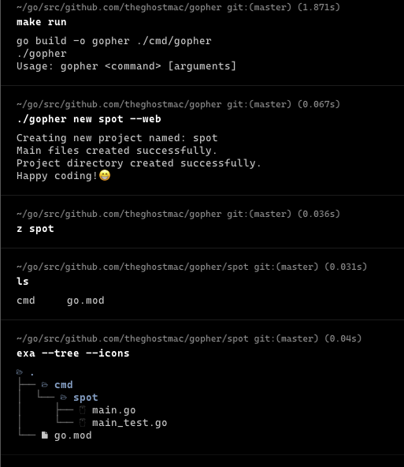

# Gopher

Gopher is a command-line tool written in Go for managing Go projects. It provides a set of features to 
help you build, test, and run your Go applications efficiently. 

Read about the project [here](https://theghostmac.github.io/posts/gopher).



## Installation

To install Gopher, you need to have Go installed on your machine. Next, run the installation:
```shell
go install github.com/theghostmac/gopher@latest
```
Uninstall by running:
```shell
go clean -i github.com/theghostmac/gopher
```

You can also install using Make by cloning the repository and running:
```shell
make install
```
Uninstall by running:
```shell
make uninstall
```

## Usage

### Basic Commands

- **`gopher init`:** Initializes a new Go project. It can be a web app, cli app, or a general app.
- **`gopher check`:** Checks your Go application whether it compiles.
- **`gopher track`:** Lists TODO comments located within your codebase to show you your progress.

### Future Features

- **`gopher generate`:** Generates code or assets based on project-specific templates.
- **`gopher lint`:** Identifies potential code style and formatting issues.
- **`gopher doc`:** Generates documentation for your project.
- **`gopher test`:** Runs tests for your project.
- **`gopher run`:** Runs your Go application.
- **`gopher build`:** Builds your Go application.
- **`gopher add`:** Adds Go module dependencies to your project.

### Command-Specific Options

For an overview of available commands and their options, run:

```shell
gopher help
```

Look back for more updates.
